# Agent Deck

*Independent project, not affiliated with or endorsed by Anthropic.*

**They rent you one agent in their cloud. Agent Deck gives you a whole team on your
own hardware.**

<p align="center">
  <a href="https://github.com/yrks12/agent-deck/raw/main/docs/media/agent-deck.mp4" title="Play the 30-second tour (MP4)">
    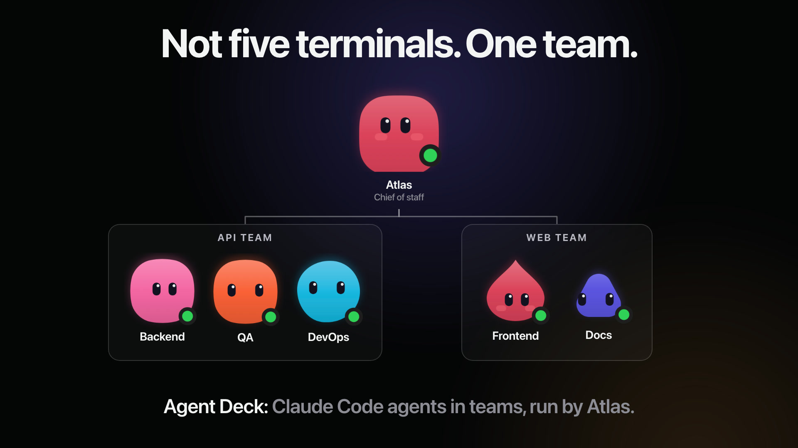
  </a>
  <br><sub>▶ <a href="https://github.com/yrks12/agent-deck/raw/main/docs/media/agent-deck.mp4">Watch the 30-second tour</a> (MP4, 6 MB; your browser plays it or saves it for your video player)</sub>
</p>

A team, not a chatbot. You talk to one agent, a chief of staff. It hires
specialist agents, briefs them, groups them into teams, and brings back only what
needs you: a decision, an approval, a sign-in. Every agent is a real
[Claude Code](https://docs.claude.com/en/docs/claude-code) session with its own desk
on your server: a name, a job, a boss, a workspace, and its own computer. You run
the team from a native Mac app, an iPhone app, a web board, or plain HTTP.

## What it does

Things the agents on the author's own deck do every day:

- **Hire and organise.** The chief of staff (on the author's deck it is called
  Atlas) hires an agent when a job needs one, writes its brief, puts it in a team
  under a boss, and retires it when the job is done, after your tap. Retired agents
  are archived, never deleted.
- **Work together.** Agents message each other by name and hand work off: the deck
  wakes the one that is asleep and brings its answer back. You see the exchange
  folded into one line of your chat.
- **Each one has its own computer.** A browser and a terminal per agent. Watch any
  screen live from your phone or Mac, approve what it asks with one tap on the
  phone, and take over when only a human will do.
- **Publish and post.** Agents write articles, publish them and get them indexed,
  run social accounts and upload video, signed in as you. Their browser switches to
  mobile mode for what sites only allow on a phone.
- **Talk, and get things back.** Call an agent from the app, or send a voice
  message. Agents send you files the same way: a screenshot shows inline, a video
  plays, a PDF opens, right in the chat.
- **Sign in once.** Log in to a site on one agent, or on your Mac, and every agent
  is signed in too. Login, 2FA and payment pages wait for your tap first.
- **Get better over time.** Correct an agent once and it saves the lesson. Shared
  lessons and saved skills reach every agent on the deck.

**Watch mode** (<kbd>⌘</kbd><kbd>⇧</kbd><kbd>W</kbd> in the Mac app): an agent's computer
fills the window, live. Screen is its browser, Terminal is its shell, Both puts them side
by side, with the chat beside them.

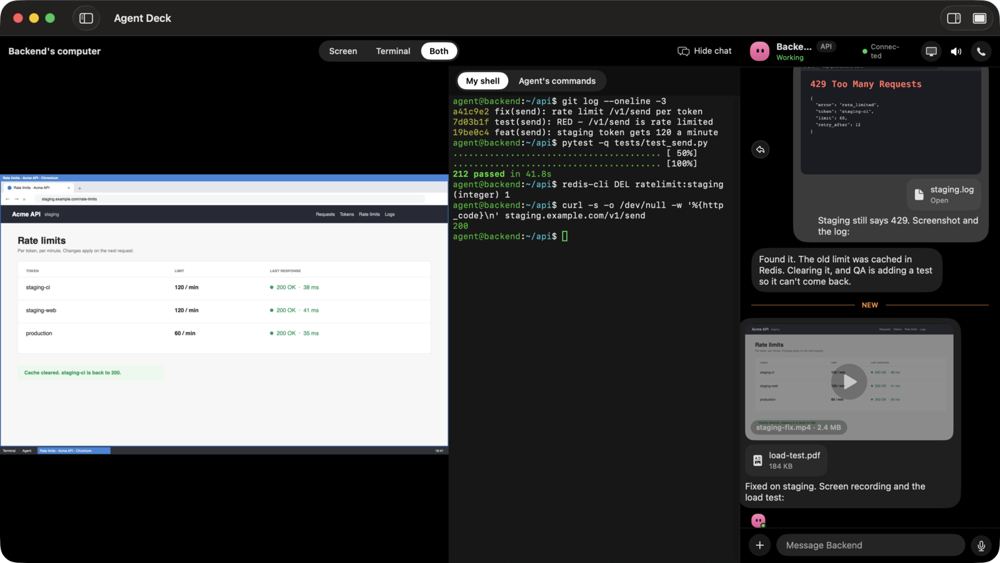

<table>
  <tr>
    <td width="25%">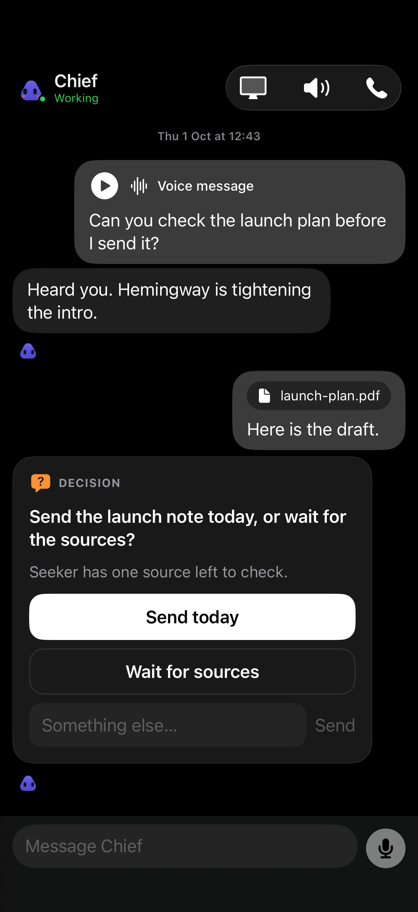</td>
    <td width="25%">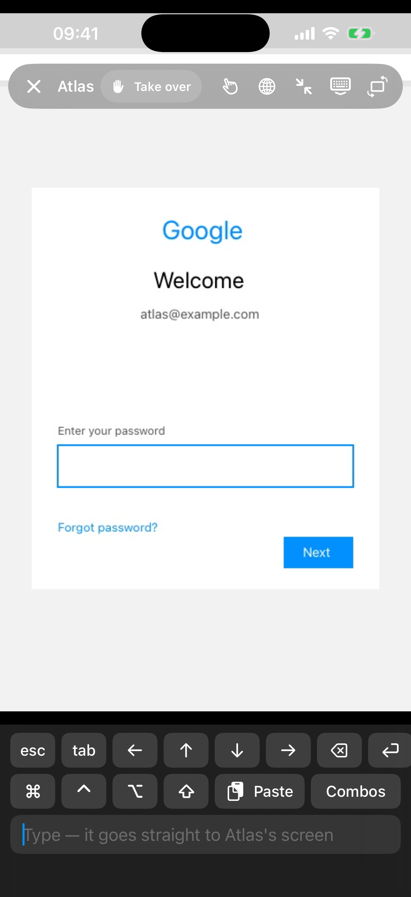</td>
    <td width="25%">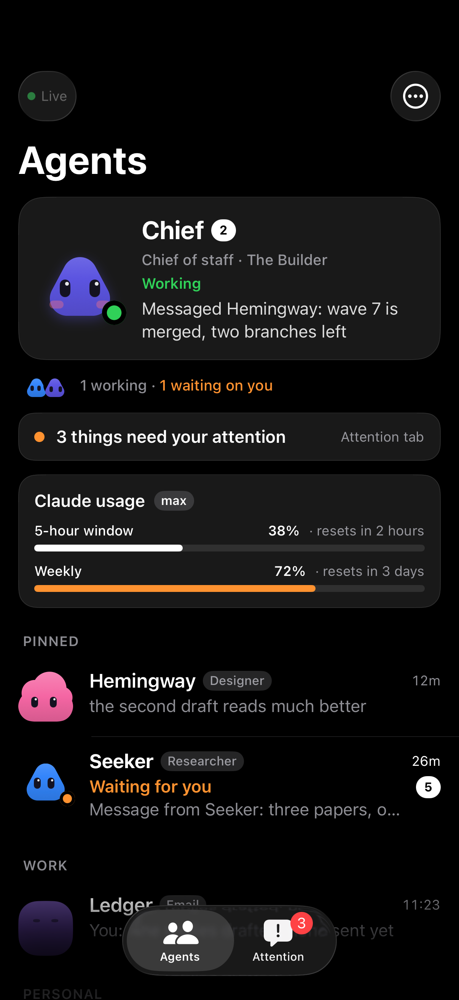</td>
    <td width="25%">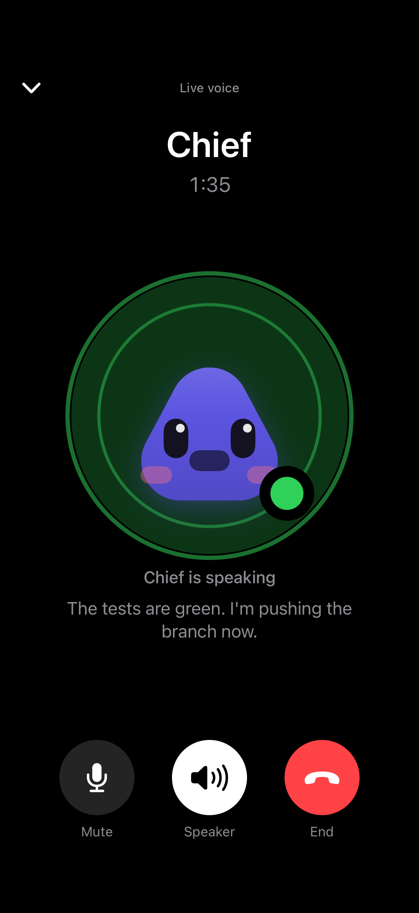</td>
  </tr>
  <tr>
    <td align="center"><sub>A thread with the chief</sub></td>
    <td align="center"><sub>An agent's live screen</sub></td>
    <td align="center"><sub>The team</sub></td>
    <td align="center"><sub>A call</sub></td>
  </tr>
</table>

*All screenshots show made-up data: a demo deck with fictional agents and companies.*

## Features

Grouped the way the server briefs every agent on what it can do
([`server/features.py`](server/features.py)).

| | |
|---|---|
| **Talk, decide, alert** | A thread per agent · decisions arrive as 2–4 buttons, not a wall of text · agents message each other by name, waking the one asleep · voice messages and live calls (your own OpenAI API key) · agents send you files that show inline: images, video, audio, PDFs · you attach screenshots and files · a push for what needs you, and only that |
| **Its own computer** | Each agent gets its own Chromium (and optionally a sandboxed desktop) · uploads into any page · mobile mode for phone-only sites · login, 2FA and payment pages wait for your Allow · a password vault that types passwords the agent never sees · log in once and every agent is signed in · one-tap sign-in from your Mac's browser or a passkey · watch its screen live, take it over, open its terminal, download its files |
| **Grow the team** | A chief of staff that hires, briefs and retires agents (archived, never deleted) · recurring work on a schedule · Connectors & Skills: install official connectors and skills per agent · lessons saved from your corrections, shared across the team, and saved skills every agent loads · Allow / Always / Never cards for risky commands, where "always" becomes a standing rule |
| **Your Mac and apps** | A native macOS app and an iPhone app, plus a web board and an HTTP + SSE API · agents can run jobs on your Mac, and drive its screen, only while you allow it |
| **Self-hosted** | Your VPS or your laptop, your Claude plan · Agent Deck stores no Claude token · binds `127.0.0.1`; only `/v1` and `/healthz` go out over HTTPS · source-available, free for noncommercial use |

## How it compares

As of Oct 2026, from public launch coverage (not confirmed by the vendors):

| | **Agent Deck** | OpenAI dots | xAI Grok Bot | Meta Muse |
|---|---|---|---|---|
| Where it runs | Your server or laptop | OpenAI's cloud | xAI's cloud | Meta's cloud |
| Agents | A team, each with its own desk | One per user | A team of bots | One per user |
| A computer per agent | Yes, its own browser (and optional desktop) | Its own computer and browser | Reportedly one shared cloud computer | Cloud VMs |
| What you pay | Your existing Claude plan | ChatGPT Pro / Business plans | Bundled in SuperGrok / Cursor plans ($20–300/mo) | Free tier, $20 and $100 plans |
| Where you reach it | Mac, iPhone (you build it), web, HTTP API | ChatGPT, Slack, Teams | SuperGrok, Cursor | iOS, Android, web, WhatsApp, Mac |
| Setup | You run one install command on a server | None | None | None (US only) |
| Code | Source-available | Closed | Closed | Closed |

Where they are ahead: no server to run, Android apps, and big plugin catalogues
(dots reports 4,000+). Where Agent Deck is ahead: the agents, their browsers, their
files and your logins stay on hardware you control, and you can read every line
that runs them.

## Get started

Three steps, one command each. Each script prints what it does and can be run again
to upgrade. Read one first if you prefer: replace `| bash` with `-o install.sh` and
open the file.

**1. Server.** On a fresh Ubuntu 24.04 or Debian 12 VPS, as root or a sudo user (on a
Mac it runs the deck locally instead):

```sh
curl -fsSL https://raw.githubusercontent.com/yrks12/agent-deck/main/install.sh | bash
```

About a minute on a fresh box. It ends with a one-time pairing code and the exact Mac
command below with that code filled in, then `sudo deckctl login` signs Claude in (a
link you open on any device). Options: `bash -s -- --ssh-tunnel` (nothing public but
SSH), `bash -s -- --domain deck.example.com` (your own domain), `bash -s -- --no-docker`
(skip the per-agent desktops).

**2. Mac app** (macOS 14+, Apple silicon). Downloads the prebuilt app from the latest
release, checks its sha256, puts it in /Applications, clears the download quarantine
flag and opens it on the Connect screen:

```sh
curl -fsSL https://raw.githubusercontent.com/yrks12/agent-deck/main/scripts/install-mac.sh | bash
```

Paste the pairing code there, or use the line the server printed (the same command
with `-s -- --pair ADK1.…`), which fills the code in for you. The app is ad-hoc
signed and not notarized, which is why the script clears the quarantine flag.
`-s -- --from-source` builds it instead (Xcode or the Command Line Tools, a few minutes).

**3. iPhone app** (optional). From a Mac with Xcode and `brew install xcodegen`, your
Apple ID (a free one) added in Xcode → Settings → Accounts, and the iPhone plugged in,
unlocked and in Developer Mode:

```sh
git clone https://github.com/yrks12/agent-deck.git && agent-deck/ios/install.sh
```

It builds the app from that checkout, signs it with your free personal team and
installs it on the phone. There is no App Store or TestFlight build. **A free Apple ID
signs an app for 7 days only**: after that the app stops opening until you run
`agent-deck/ios/install.sh` again (same app, pairing kept). Free accounts also allow at
most 3 sideloaded apps on a phone at once. `--dry-run` prints every step without
building.

Step by step, measured times and every option: **[docs/quickstart.md](docs/quickstart.md)**.

## How it fits together

- **Server** (`server/`, Python/FastAPI): the roster, threads, hiring,
  approvals, routines, and the agents' computers. It runs on your laptop or on an
  always-on Ubuntu VPS.
- **macOS app** (`macos/`, SwiftUI): the conversation, approval cards,
  watching and taking over an agent's screen, and optional voice calls.
- **Hooks** (`hooks/`): small Node scripts Claude Code runs, so the deck sees
  state and answers permission prompts.

```text
Agent Deck for macOS ── HTTPS /v1 API + SSE ── Agent Deck server ── claude (Claude Code CLI)
   (or the web board, or curl)                   server/ + hooks/      one session per agent
```

## Screenshots

Made-up data throughout (the app's built-in demo deck).

**Mac**

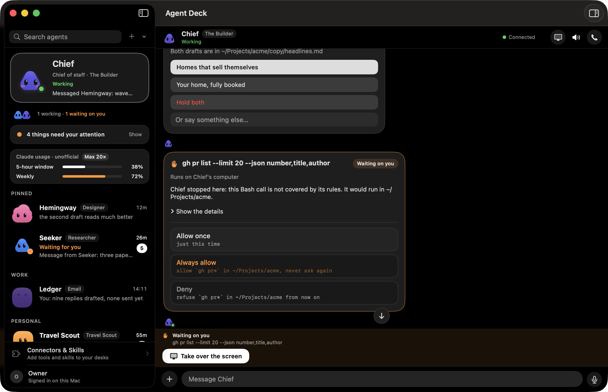

| | |
|---|---|
| 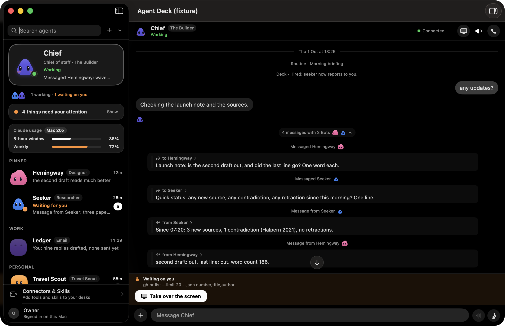 | 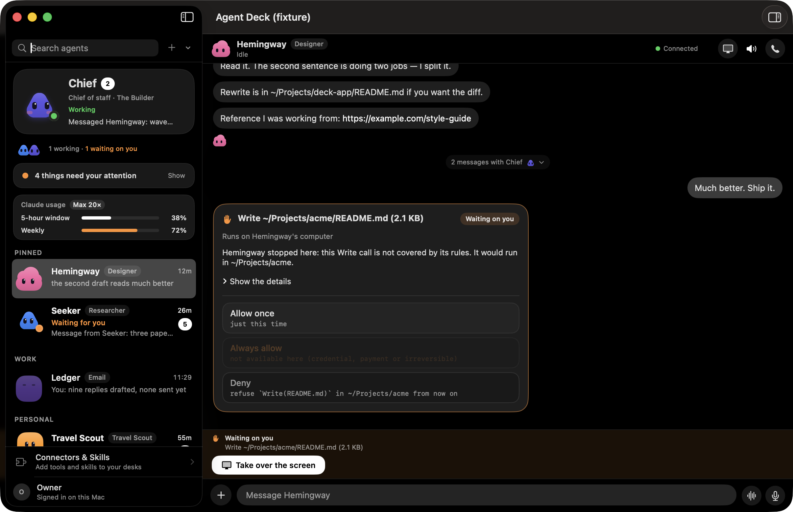 |
| Messages between agents fold into a chip; open it to read the exchange. | An agent stopped on a call that needs you: allow once, always allow, or deny. |
| 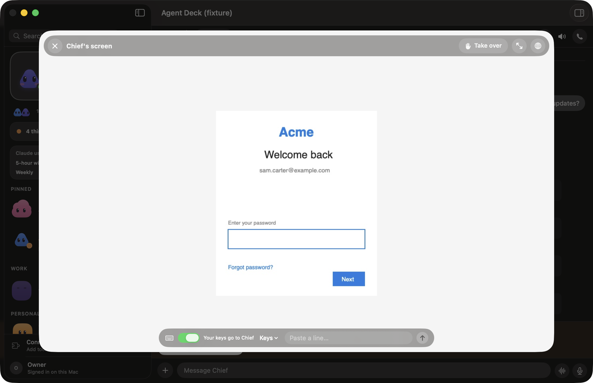 | 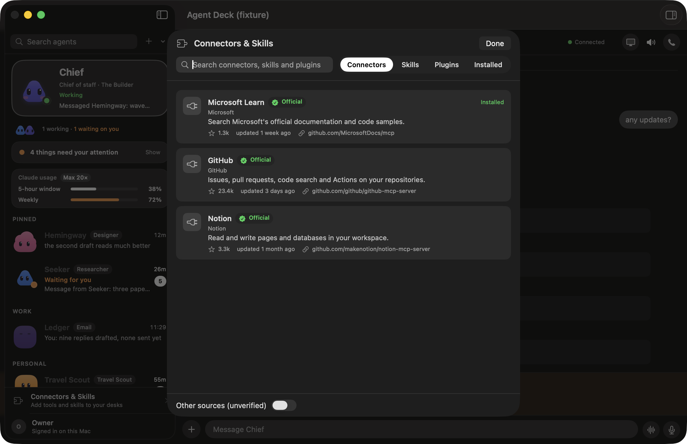 |
| Watch an agent's screen, and take it over when it needs a human. | Connectors & Skills. |
|  | |
| Connect to a deck with a one-time pairing code. | |

**iPhone**

| | | |
|---|---|---|
|  | 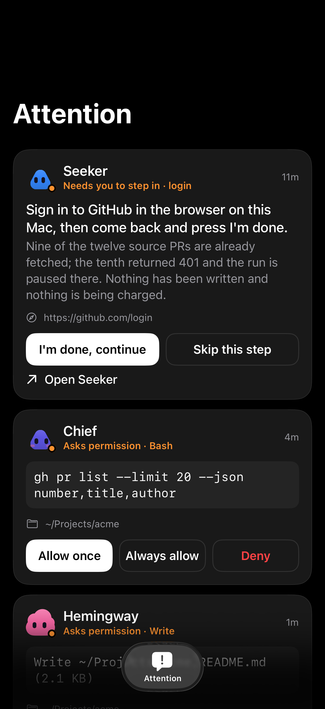 |  |
| Call an agent. | Attention: only what needs you. | Connect with a pairing code. |
| 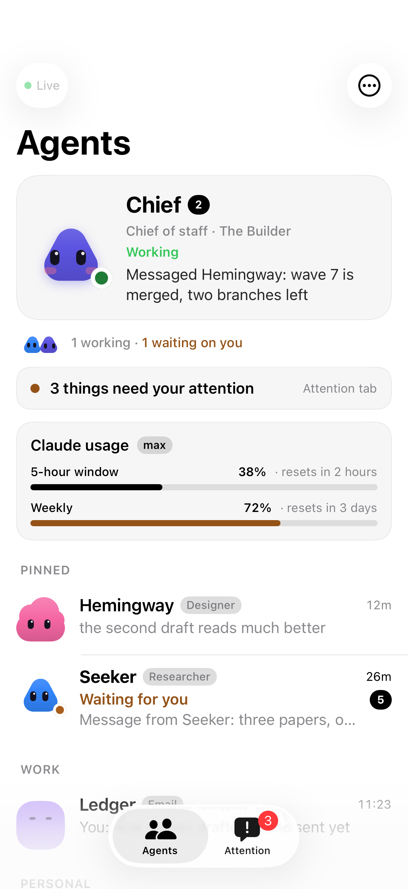 | 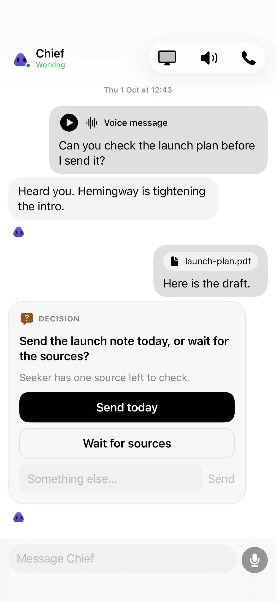 | |
| Light mode. | Light mode. | |

## Requirements

- **A Claude account for Claude Code.** Every agent is a real Claude Code
  session and uses your plan. On a laptop, any way you have signed `claude` in
  works. On a server, `sudo deckctl login` runs Claude's own sign-in
  (`claude auth login`) for the service user. Agent Deck stores no Claude token:
  the Claude CLI keeps and refreshes its own login. Some terms questions about always-on use are still open; see
  [docs/terms-questions.md](docs/terms-questions.md).
- **Server:** Ubuntu 24.04 (x86_64 or arm64), 2 vCPU, 4 GB RAM. Use a machine
  dedicated to Agent Deck. **Laptop:** macOS or Linux with Python 3.11+ and Node.
- **macOS app (optional):** macOS 14 or newer. The Mac one-liner installs the latest
  release, or builds from source (`make app`, needs Xcode or its Command Line Tools)
  when there is none. No Apple Developer account is needed. The iPhone app builds
  from source with a free personal team (the iPhone one-liner does it).
- **Voice calls (optional):** your own OpenAI API key.

## Which agent runtimes work

| | Claude Code | OpenCode | Codex |
|---|---|---|---|
| Start, background sessions, wake and resume | full | start only | launch only |
| Approvals, permissions, deck tools in the session | full | none | none |
| Live on the board | full | yes | no |

Claude Code is the supported runtime. OpenCode and Codex support is partial, and
contributions are welcome. Other tools (Cursor, Gemini CLI, Aider) are not
supported.

## Security, in one paragraph

Agents run with **full access** to the machine they are on. That is the point,
and the reason to give them a dedicated VPS. The API is closed unless a bearer
token is set. The deck binds only `127.0.0.1`. On a public server, only `/v1`
and `/healthz` pass through HTTPS on 443. Never expose port 7788 or 7789
directly. Details, and where every secret is stored: **[docs/security.md](docs/security.md)**.

## Repository map

- `server/`: API, agent roster, threads, hiring, approvals, routines,
  browser/computer control, runtime collection.
- `macos/`: the native app, its transport, XCTest and XCUITest suites.
- `hooks/`: Claude Code lifecycle, permission, and office hooks.
- `web/`: the browser board served by the same backend.
- `docker/`: the per-agent computer image.
- `deploy/`: the installer, unit templates, and the Caddy edge.
- `bin/`: `deckctl` (server admin), `deck` (the agents' office CLI), `cdash`
  (local launcher).
- `docs/client-api.md`: the `/v1` contract between the server and any client.

## Develop and test

```sh
make setup          # uv venv + dev requirements
make test-backend   # pytest (live and UI tests are opt-in: -m live / -m ui)
make test-macos     # swift test
```

Tests marked `live` or `ui` can start real agents, spend tokens, or drive a
visible app. They are excluded by default. See [CONTRIBUTING.md](CONTRIBUTING.md).

## License

Source-available under the [PolyForm Noncommercial License 1.0.0](LICENSE): free
for any noncommercial use, such as personal projects, study, research, hobby
work, and the noncommercial organizations the license names. Licensor: YAIRTECH LTD.
See [NOTICE](NOTICE).

**Commercial use** needs a separate commercial license from the licensor. To ask
for one, contact [@yrks12](https://github.com/yrks12) on GitHub.

"Claude" and "Claude Code" are trademarks of their owner and are used here only
to describe compatibility.
