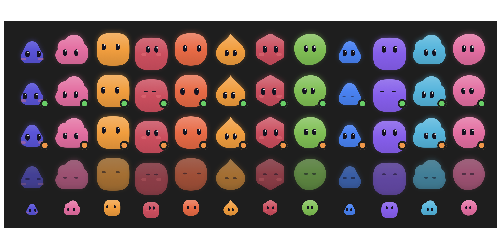

# Agent Deck

**Run a team of AI coding agents from one conversation.** Talk to a chief agent.
It hires specialist agents, hands them work, and brings back their questions,
approvals, and results. You see everything in one place: a native macOS app, a
web board, or a plain HTTP API.

Agent Deck works with [Claude Code](https://docs.claude.com/en/docs/claude-code).
It is an independent open-source project, not affiliated with or endorsed by
Anthropic or any other AI provider.



## Why

One Claude Code session is easy to watch. Five are not. Agent Deck gives each
agent a desk: a name, a job, a workspace, and optionally its own sandboxed
computer and browser. It keeps one thread per agent and shows you only what
needs you: a permission to grant, a decision to make, or a sign-in only a human
can do. Agents can message each other and report to a boss agent. Scheduled
routines can wake them up.

- **Server** (`server/`, Python/FastAPI): the roster, threads, hiring,
  approvals, routines, and the agents' computers. It runs on your laptop or on an
  always-on Ubuntu VPS.
- **macOS app** (`macos/`, SwiftUI): the conversation, approval cards,
  watching and taking over an agent's screen, and optional voice calls.
- **Hooks** (`hooks/`): small Node scripts Claude Code runs, so the deck sees
  state and answers permission prompts.

```text
Agent Deck for macOS ── HTTPS /v1 API + SSE ── Agent Deck server ── claude (Claude Code CLI)
   (or the web board, or curl)                   server/ + hooks/      one session per agent
```

## Quickstart

About 5 minutes on your laptop, or about 10 minutes on a fresh Ubuntu 24.04 VPS.
No VPN required. **→ [docs/quickstart.md](docs/quickstart.md)**

```sh
git clone <REPO_URL> /opt/agent-deck
sudo /opt/agent-deck/deploy/install-deck.sh      # Ubuntu 24.04; prints its plan and asks first
```

## Requirements

- **A Claude account for Claude Code.** Every agent is a real Claude Code
  session and uses your plan. On a laptop, any way you have signed `claude` in
  works. The server installer signs in with `claude setup-token`, which needs a
  Claude subscription. Signing a server in with an API key is not built into the
  installer yet. Some terms questions about always-on use are still open; see
  [docs/terms-questions.md](docs/terms-questions.md).
- **Server:** Ubuntu 24.04 (x86_64 or arm64), 2 vCPU, 4 GB RAM. Use a machine
  dedicated to Agent Deck. **Laptop:** macOS or Linux with Python 3.11+ and Node.
- **macOS app (optional):** macOS 14 or newer. Build it from source for now; see
  the quickstart for the unsigned-app Gatekeeper step.
- **Voice calls (optional):** your own OpenAI API key.

## Which agent runtimes work

| | Claude Code | OpenCode | Codex |
|---|---|---|---|
| Start, background sessions, wake and resume | full | start only | launch only |
| Approvals, permissions, deck tools in the session | full | none | none |
| Live on the board | full | yes | no |

Claude Code is the supported runtime. OpenCode and Codex support is partial, and
contributions are welcome. Other tools (Cursor, Gemini CLI, Aider) are not
supported.

## Security, in one paragraph

Agents run with **full access** to the machine they are on. That is the point,
and the reason to give them a dedicated VPS. The API is closed unless a bearer
token is set. The deck binds only `127.0.0.1`. On a public server, only `/v1`
and `/healthz` pass through HTTPS on 443. Never expose port 7788 or 7789
directly. Details, and where every secret is stored: **[docs/security.md](docs/security.md)**.

## Repository map

- `server/`: API, agent roster, threads, hiring, approvals, routines,
  browser/computer control, runtime collection.
- `macos/`: the native app, its transport, XCTest and XCUITest suites.
- `hooks/`: Claude Code lifecycle, permission, and office hooks.
- `web/`: the browser board served by the same backend.
- `docker/`: the per-agent computer image.
- `deploy/`: the installer, unit templates, and the Caddy edge.
- `bin/`: `deckctl` (server admin), `deck` (the agents' office CLI), `cdash`
  (local launcher).
- `docs/client-api.md`: the `/v1` contract between the server and any client.

## Develop and test

```sh
make setup          # uv venv + dev requirements
make test-backend   # pytest (live and UI tests are opt-in: -m live / -m ui)
make test-macos     # swift test
```

Tests marked `live` or `ui` can start real agents, spend tokens, or drive a
visible app. They are excluded by default. See [CONTRIBUTING.md](CONTRIBUTING.md).

## License

Apache License 2.0. See [LICENSE](LICENSE) and [NOTICE](NOTICE). "Claude" and
"Claude Code" are trademarks of their owner and are used here only to describe
compatibility.
