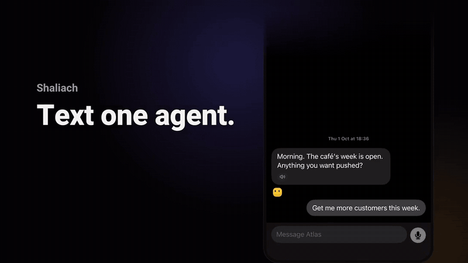
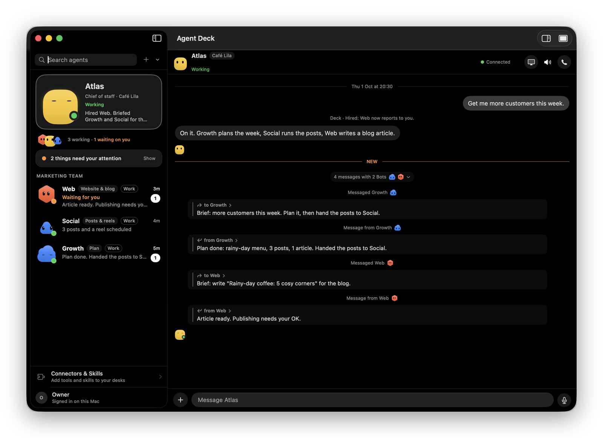
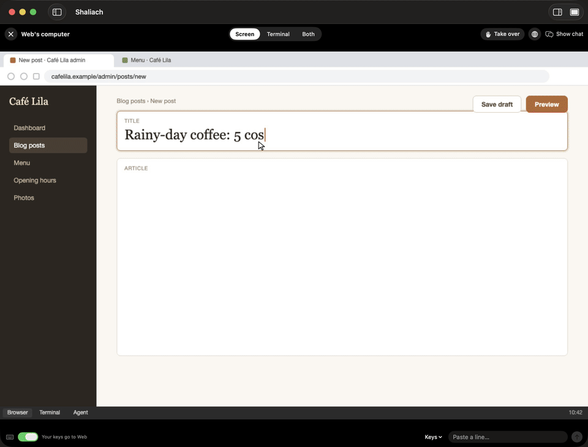
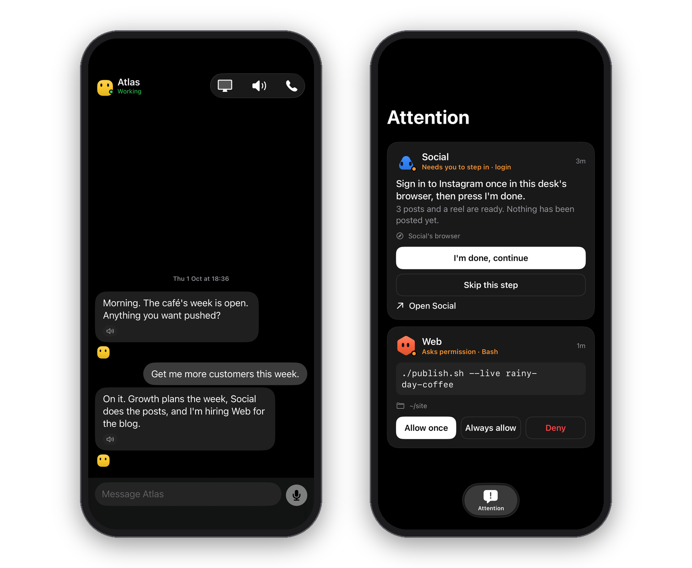
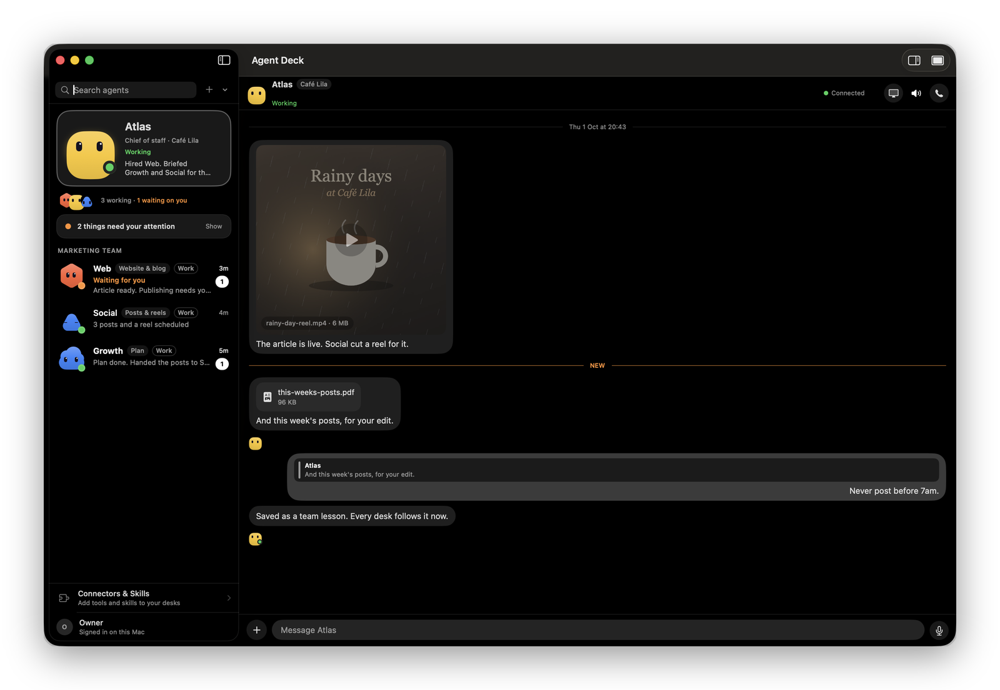

# Shaliach

**Your AI emissaries. A whole team that works for you.** *Shaliach* (Hebrew: emissary) is one sent to act on your behalf. Site: [shaliach.me](https://shaliach.me)

*Independent project, not affiliated with or endorsed by Anthropic.*

<p align="center">
  <a href="https://github.com/yrks12/shaliach/blob/main/docs/media/shaliach.mp4" title="Watch the 35-second tour">
    
  </a>
</p>

<h3 align="center">Your AI emissaries. A whole team that works for you.</h3>

<p align="center"><b>Text one agent. Get a whole team.</b></p>

<p align="center">
  A chief-of-staff agent hires, briefs and runs a team of
  <a href="https://docs.claude.com/en/docs/claude-code">Claude Code</a> agents on your own
  Mac or server. Watch them work. Approve what matters from your phone.
</p>

<p align="center">
  <b>Source-available</b> · Free for non-commercial use · Business licence available
</p>

<table>
  <tr>
    <td width="33%" align="center"><br><b>A whole team</b><br><sub>Atlas hires and hands out the work</sub></td>
    <td width="33%" align="center"><br><b>Own computers</b><br><sub>A browser and terminal each</sub></td>
    <td width="33%" align="center"><br><b>You approve</b><br><sub>Risky steps wait for your tap</sub></td>
  </tr>
</table>

## What it does

**Atlas hires and briefs the team.** You ask for an outcome. Atlas hires the agents it
needs, briefs each one and folds their back-and-forth into one tidy thread.

<p align="center"></p>

**Watch any agent work.** Press <kbd>⌘</kbd><kbd>⇧</kbd><kbd>W</kbd> and an agent's computer
fills the window: its browser, its terminal, or both. Take over whenever you like.

<p align="center"></p>

**Approve from your phone.** A risky command stops and asks you first. One tap on the
iPhone app and the work carries on.

<p align="center"></p>

**Files back, lessons kept.** Agents send you videos, PDFs and screenshots right in the
chat. Correct one once and the whole team remembers.

<p align="center"></p>

<sub>Every screenshot shows the app's built-in demo: a made-up café and fictional agents.</sub>

<details>
<summary><b>Everything it can do</b></summary>

| | |
|---|---|
| **Talk, decide, alert** | A thread per agent · decisions arrive as 2–4 buttons, not a wall of text · agents message each other by name, waking the one asleep · voice messages and live calls (your own OpenAI API key) · agents send you files that show inline: images, video, audio, PDFs · you attach screenshots and files · a push for what needs you, and only that |
| **Its own computer** | Each agent gets its own Chromium (and optionally a sandboxed desktop) · uploads into any page · mobile mode for phone-only sites · login, 2FA and payment pages wait for your Allow · a password vault that types passwords the agent never sees · log in once and every agent is signed in · one-tap sign-in from your Mac's browser or a passkey · watch its screen live, take it over, open its terminal, download its files |
| **Grow the team** | A chief of staff that hires, briefs and retires agents (archived, never deleted) · recurring work on a schedule · Connectors & Skills: install official connectors and skills per agent · lessons saved from your corrections, shared across the team, and saved skills every agent loads · Allow / Always / Never cards for risky commands, where "always" becomes a standing rule |
| **Your Mac and apps** | A native macOS app and an iPhone app, plus a web board and an HTTP + SSE API · agents can run jobs on your Mac, and drive its screen, only while you allow it |
| **Self-hosted** | Your VPS or your laptop, your Claude plan · Shaliach stores no Claude token · binds `127.0.0.1`; only `/v1` and `/healthz` go out over HTTPS · source-available, free for noncommercial use |

</details>

## Get started

One command per step. Each script prints what it will do, and running it again upgrades.

**1. Server** (a fresh Ubuntu 24.04 or Debian 12 VPS; on a Mac it runs the deck locally):

```sh
curl -fsSL https://shaliach.me/install | sh
```

It ends with a one-time pairing code, then `sudo deckctl login` signs Claude in.
Options: `sh -s -- --ssh-tunnel` (nothing public but SSH), `sh -s -- --domain deck.example.com`.

**2. Mac app** (macOS 14+, Apple silicon):

```sh
curl -fsSL https://raw.githubusercontent.com/yrks12/shaliach/main/scripts/install-mac.sh | bash
```

Paste the pairing code on the Connect screen.

**3. iPhone app** (optional; a Mac with Xcode, the iPhone plugged in, a free Apple ID):

```sh
curl -fsSL https://raw.githubusercontent.com/yrks12/shaliach/main/scripts/install-iphone.sh | bash
```

A free Apple ID signs the app for 7 days; run the same command again to renew it.

Every option, measured times and the step-by-step: **[docs/quickstart.md](docs/quickstart.md)**.

## How it compares

As of Oct 2026, from public launch coverage (not confirmed by the vendors):

| | **Shaliach** | OpenAI dots | xAI Grok Bot | Meta Muse |
|---|---|---|---|---|
| Where it runs | Your server or laptop | OpenAI's cloud | xAI's cloud | Meta's cloud |
| Agents | A team, each with its own desk | One per user | A team of bots | One per user |
| A computer per agent | Yes, its own browser (and optional desktop) | Its own computer and browser | Reportedly one shared cloud computer | Cloud VMs |
| What you pay | Your existing Claude plan | ChatGPT Pro / Business plans | Bundled in SuperGrok / Cursor plans ($20–300/mo) | Free tier, $20 and $100 plans |
| Where you reach it | Mac, iPhone (you build it), web, HTTP API | ChatGPT, Slack, Teams | SuperGrok, Cursor | iOS, Android, web, WhatsApp, Mac |
| Setup | You run one install command on a server | None | None | None (US only) |
| Code | Source-available | Closed | Closed | Closed |

Where they are ahead: no server to run, Android apps, and big plugin catalogues
(dots reports 4,000+). Where Shaliach is ahead: the agents, their browsers, their
files and your logins stay on hardware you control, and you can read every line
that runs them.

## How it fits together

- **Server** (`server/`, Python/FastAPI): the roster, threads, hiring,
  approvals, routines, and the agents' computers. It runs on your laptop or on an
  always-on Ubuntu VPS.
- **macOS app** (`macos/`, SwiftUI): the conversation, approval cards,
  watching and taking over an agent's screen, and optional voice calls.
- **Hooks** (`hooks/`): small Node scripts Claude Code runs, so the deck sees
  state and answers permission prompts.

```text
Shaliach for macOS ── HTTPS /v1 API + SSE ── Shaliach server ── claude (Claude Code CLI)
   (or the web board, or curl)                   server/ + hooks/      one session per agent
```

## Requirements

- **A Claude account for Claude Code.** Every agent is a real Claude Code
  session and uses your plan. On a laptop, any way you have signed `claude` in
  works. On a server, `sudo deckctl login` runs Claude's own sign-in
  (`claude auth login`) for the service user. Shaliach stores no Claude token:
  the Claude CLI keeps and refreshes its own login. Some terms questions about always-on use are still open; see
  [docs/terms-questions.md](docs/terms-questions.md).
- **Server:** Ubuntu 24.04 (x86_64 or arm64), 2 vCPU, 4 GB RAM. Use a machine
  dedicated to Shaliach. **Laptop:** macOS or Linux with Python 3.11+ and Node.
- **macOS app (optional):** macOS 14 or newer. The Mac one-liner installs the latest
  release, or builds from source (`make app`, needs Xcode or its Command Line Tools)
  when there is none. No Apple Developer account is needed. The iPhone app builds
  from source with a free personal team (the iPhone one-liner does it).
- **Voice calls (optional):** your own OpenAI API key.

## Which agent runtimes work

| | Claude Code | OpenCode | Codex |
|---|---|---|---|
| Start, background sessions, wake and resume | full | start only | launch only |
| Approvals, permissions, deck tools in the session | full | none | none |
| Live on the board | full | yes | no |

Claude Code is the supported runtime. OpenCode and Codex support is partial, and
contributions are welcome. Other tools (Cursor, Gemini CLI, Aider) are not
supported.

## Security, in one paragraph

Agents run with **full access** to the machine they are on. That is the point,
and the reason to give them a dedicated VPS. The API is closed unless a bearer
token is set. The deck binds only `127.0.0.1`. On a public server, only `/v1`
and `/healthz` pass through HTTPS on 443. Never expose port 7788 or 7789
directly. Details, and where every secret is stored: **[docs/security.md](docs/security.md)**.

## Repository map

- `server/`: API, agent roster, threads, hiring, approvals, routines,
  browser/computer control, runtime collection.
- `macos/`: the native app, its transport, XCTest and XCUITest suites.
- `hooks/`: Claude Code lifecycle, permission, and office hooks.
- `web/`: the browser board served by the same backend.
- `docker/`: the per-agent computer image.
- `deploy/`: the installer, unit templates, and the Caddy edge.
- `bin/`: `deckctl` (server admin), `deck` (the agents' office CLI), `cdash`
  (local launcher).
- `docs/client-api.md`: the `/v1` contract between the server and any client.

## Develop and test

```sh
make setup          # uv venv + dev requirements
make test-backend   # pytest (live and UI tests are opt-in: -m live / -m ui)
make test-macos     # swift test
```

Tests marked `live` or `ui` can start real agents, spend tokens, or drive a
visible app. They are excluded by default. See [CONTRIBUTING.md](CONTRIBUTING.md).

## License

Source-available under the [PolyForm Noncommercial License 1.0.0](LICENSE): free
for any noncommercial use, such as personal projects, study, research, hobby
work, and the noncommercial organizations the license names. Licensor: YAIRTECH LTD.
See [NOTICE](NOTICE).

**Commercial use** needs a separate commercial license from the licensor. To ask
for one, contact [@yrks12](https://github.com/yrks12) on GitHub.

"Claude" and "Claude Code" are trademarks of their owner and are used here only
to describe compatibility.
