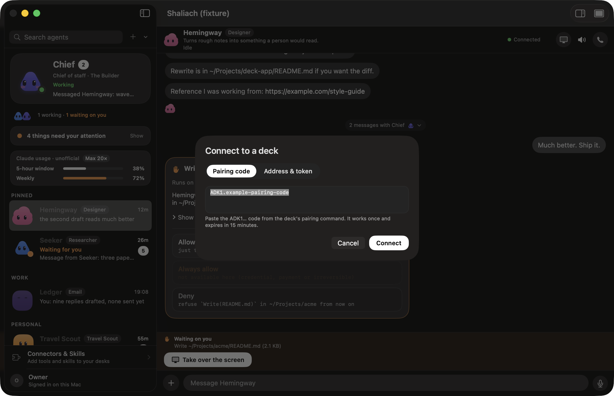
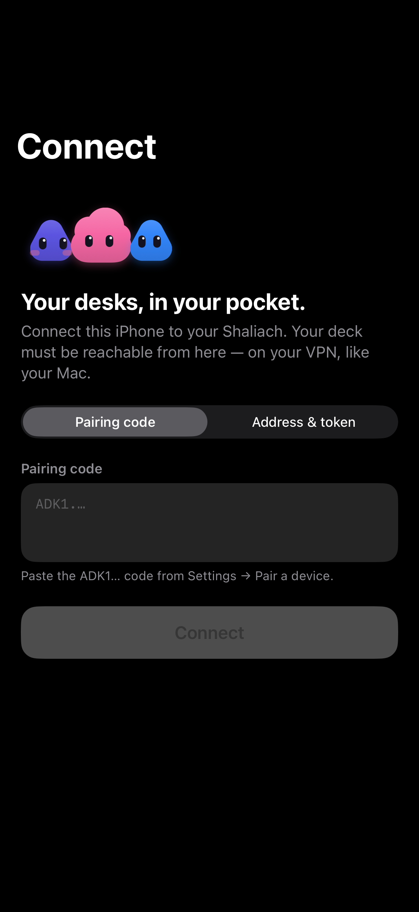

# Quickstart

Two ways to try Shaliach. Pick one.

| | Where it runs | Time (measured) | Needs |
|---|---|---|---|
| **A. On your laptop** | macOS or Linux, loopback only | ~5 min | Python 3.11+, Node, Claude Code already signed in |
| **B. On a server** | a fresh Ubuntu 24.04 VPS, always on | ~10 min | root on the VPS, a Claude account (you sign in with `sudo deckctl login`) |

Both end the same way: the deck answers `/healthz`, you create an agent, you send
it a message. Each path is one command:

```sh
curl -fsSL https://shaliach.me/install | sh
```

On a Mac that command runs the deck on the laptop (A). On Ubuntu or Debian it sets up
a server (B). Run it again at any time to upgrade; it keeps your token, login and
paired devices, and it stops rather than overwrite a checkout you have edited.

Before you start, read [security.md](security.md). Agents started by the deck run
with full access to the machine they are on.

## A. On your laptop (no server, nothing exposed)

The deck binds `127.0.0.1` only. It also shows the Claude Code sessions you
already have running on this machine, because it reads `~/.claude`.

On a Mac, the one-liner above does all of this: it clones to `~/agent-deck`, makes
the Python environment (with [uv](https://docs.astral.sh/uv/) if you have it), creates
the token, and runs the deck at login as a LaunchAgent on `127.0.0.1:7788`
(`AGENT_DECK_PORT` to change it). It prints the board's address and how to connect the
app. On Linux, or to do it by hand, follow these steps.

You need:

- Python 3.11 or newer. macOS ships 3.9 as `python3`, so use
  [uv](https://docs.astral.sh/uv/) (below) or `brew install python@3.13`.
- Node.js (the session hooks are small Node scripts).
- Claude Code installed, and `claude` already signed in in your terminal.

```sh
git clone https://github.com/yrks12/shaliach.git agent-deck && cd agent-deck
uv venv --python 3.13 .venv
uv pip install --python .venv/bin/python -r requirements.txt

# One token for this deck, kept where the deck and its hooks look for it.
mkdir -p ~/.claude/agent-bus
[ -s ~/.claude/agent-bus/deck-token.txt ] || (umask 077; openssl rand -hex 32 > ~/.claude/agent-bus/deck-token.txt)
export AGENT_DECK_TOKEN="$(cat ~/.claude/agent-bus/deck-token.txt)"

.venv/bin/python -m uvicorn server.app:app --host 127.0.0.1 --port 7788
```

Without `AGENT_DECK_TOKEN` the API answers `503 auth_not_configured` to every
`/v1` request. That is on purpose. Export the token as shown above before you start.

In a second terminal:

```sh
TOKEN="$(cat ~/.claude/agent-bus/deck-token.txt)"
curl -s http://127.0.0.1:7788/healthz                       # {"ok":true}

# Create your first agent
curl -s -H "Authorization: Bearer $TOKEN" -H 'content-type: application/json' \
  -X POST http://127.0.0.1:7788/v1/agents \
  -d '{"name":"helper","engine":"claude","cwd":"/tmp","charter":"A general helper."}'

# Talk to it (this starts a Claude Code session and uses your plan or API credit)
curl -s -H "Authorization: Bearer $TOKEN" -H 'content-type: application/json' \
  -X POST 'http://127.0.0.1:7788/v1/threads/direct:helper/messages' \
  -d '{"text":"Hi. In one line, what can you do?"}'
```

To open the web board, go to `http://127.0.0.1:7788/?t=<your token>`. The token is
swapped for an HttpOnly cookie and removed from the URL. The macOS app looks for
a deck at `http://127.0.0.1:7788` by default (see [The macOS app](#the-macos-app)).

The deck puts a new agent in a workspace it creates under
`~/.claude/agent-bus/workspaces/<name>`, not in the `cwd` you send. The response's
`seat` field tells you where it went.

Run one deck per user account. Two decks on the same account compete for the same
socket under `/tmp/cc-socks`.

## B. On a server (Ubuntu 24.04)

Use a VPS that does nothing else: 2 vCPU, 4 GB RAM, 40 GB disk, any provider.
The deck's service user can run anything on it (see [security.md](security.md)).

SSH in (as root, or a user with sudo) and run:

```sh
curl -fsSL https://shaliach.me/install | sh
```

That installs git, clones Shaliach to `/opt/agent-deck`, and runs
`/opt/agent-deck/deploy/install-deck.sh`, which:

1. Prints its plan (what it will install, the address you will get) and asks
   `Continue? [Y/n]` (with no terminal, for example from cloud-init, it goes ahead).
2. Installs Python, Node, Claude Code for a new system user `agentdeck`, Caddy,
   and Docker. Docker gives each agent its own desktop. Building that image takes
   a few minutes and about 1.5 GB. Pass `--no-docker` to skip it.
3. Opens only SSH and 443 in `ufw`. Keeps the deck itself on `127.0.0.1:7789`.
4. Checks every piece (`PASS`/`FAIL` lines), runs `deckctl doctor`, and prints a
   one-time pairing code.

The one-liner then prints the Mac command with that code filled in:

```sh
curl -fsSL https://raw.githubusercontent.com/yrks12/shaliach/main/scripts/install-mac.sh | bash -s -- --pair ADK1.…
```

and, last, signs Claude in with `sudo deckctl login`: it prints a link. Open it on
any device and approve. That is Claude's own sign-in (`claude auth login`); the
Claude CLI keeps the login, and Shaliach never sees a token. Run from a terminal, it asks right there; otherwise it prints
`sudo deckctl login` for you to run (it restarts the deck so the login takes).

You can safely run it again. It keeps your token and changes only what differs.

Your API token:

```sh
sudo sed -n 's/^AGENT_DECK_TOKEN=//p' /etc/agent-deck/agentdeck.env
```

Then, from your laptop (set `DECK` to the address the installer printed):

```sh
DECK=https://203-0-113-7.sslip.io
TOKEN=<the token above>
curl -s $DECK/healthz
curl -s -H "Authorization: Bearer $TOKEN" -H 'content-type: application/json' \
  -X POST $DECK/v1/agents -d '{"name":"helper","engine":"claude","cwd":"/tmp","charter":"A general helper."}'
curl -s -H "Authorization: Bearer $TOKEN" -H 'content-type: application/json' \
  -X POST "$DECK/v1/threads/direct:helper/messages" -d '{"text":"Hi. In one line, what can you do?"}'
```

### Choose how you reach it

None of these need a VPN.

| Option | One-liner flag | You reach it at | Notes |
|---|---|---|---|
| **Public HTTPS (default)** | *(no flag)* | `https://a-b-c-d.sslip.io` | Real Let's Encrypt/ZeroSSL certificate, no domain needed. Caddy forwards only `/v1/*` and `/healthz`. The board and `/api` stay private. |
| **Your own domain** | `--domain deck.example.com` | `https://deck.example.com` | Point an A record at the VPS first. Add `--acme-email you@example.com` if you like. |
| **SSH tunnel only** | `--ssh-tunnel` | `http://127.0.0.1:7789` via `ssh -L 7789:127.0.0.1:7789 -N root@<vps>` | Nothing public but SSH. The simplest private setup. The board works through the tunnel too. |
| **Tailscale** | `--ssh-tunnel`, then `sudo tailscale serve --bg 7789` | `https://<machine>.<tailnet>.ts.net` | Only your tailnet can reach it, but it sees the whole deck, board included. Documented, not tested by us yet. |
| **No public IPv4** | *(automatic)* or `--tls=self-signed` | `https://<its IP>` | Uses a self-signed certificate that the pairing code pins. The macOS and iPhone apps both take the pinned code. |

The same choices as commands:

```sh
curl -fsSL https://shaliach.me/install | sh -s -- --ssh-tunnel
curl -fsSL https://shaliach.me/install | sh -s -- --domain deck.example.com --acme-email you@example.com
curl -fsSL https://shaliach.me/install | sh -s -- --tls=self-signed
curl -fsSL https://shaliach.me/install | sh -s -- --no-docker
```

Every flag the one-liner does not know itself (`--ssh-tunnel`, `--domain`) goes
straight to the installer, which you can also run directly on a checkout:

```sh
/opt/agent-deck/deploy/install-deck.sh                                    # public HTTPS on sslip.io
/opt/agent-deck/deploy/install-deck.sh --tls=domain --hostname deck.example.com --acme-email you@example.com
/opt/agent-deck/deploy/install-deck.sh --tls=none                         # SSH tunnel or Tailscale
/opt/agent-deck/deploy/install-deck.sh --tls=self-signed                  # no public IPv4
/opt/agent-deck/deploy/install-deck.sh --no-docker --skip-login           # fastest try-out
```

For a non-interactive install (cloud-init, CI), pass `--yes --skip-login` to
`install-deck.sh`, then run `sudo deckctl login` once and open the link Claude
prints. Shaliach never asks for or keeps a Claude token, so there is no token
file to pass. You can add `--openai-key-file /root/openai-key` for voice calls,
which are optional.

Useful afterwards:

```sh
sudo deckctl status      # one screen: running, address, certificate, login, version
sudo deckctl doctor      # every check, with a plain-English fix for each failure
sudo deckctl login       # sign Claude in again (tokens last about a year)
sudo deckctl uninstall   # remove it; keeps your data unless --purge
journalctl -u agentdeck -f
```

## The macOS app

The app is optional. It is a native client for any deck.

No Apple Developer account is needed for any of this.

```sh
curl -fsSL https://raw.githubusercontent.com/yrks12/shaliach/main/scripts/install-mac.sh | bash -s -- --pair <code>
```

It installs the latest release `.zip` (refused unless its published `.sha256`
matches) or, when there is no release yet, builds from source with `make app` (needs
Xcode or the Command Line Tools; a few minutes). It installs to `/Applications`
(`--prefix DIR` for elsewhere), clears the download quarantine flag, and opens the app.
With `--pair`, the **Connect** screen opens with the code filled in: click Connect.
Without it, open **Connect** yourself (from Settings, or from the screen the app shows
when it has no deck) and paste a code from `sudo deckctl pair`, or enter an address
and token (`http://127.0.0.1:7789` through the SSH tunnel). Run it again to upgrade.

While the repository is private, the download needs a GitHub token. Set `GH_TOKEN`
(for example `GH_TOKEN=$(gh auth token)`) in front of `bash`; once the repository is
public no token is needed. A pre-release is used when no stable release exists.



By hand:

- **Build it yourself** (Xcode 15 or newer, macOS 14 or newer): `make app`
  (the same as `macos/Scripts/make-app-bundle.sh release`) puts `Shaliach.app`
  in `macos/dist/`. A build you made yourself opens normally.
- **Downloaded app.** Release builds are unsigned or ad-hoc signed, and not
  notarized. The first time you open one, macOS blocks it.
  Go to **System Settings → Privacy & Security**, scroll to the message about
  Shaliach, and click **Open Anyway**. On macOS 15 and later, right-click → Open
  no longer skips the check. From Terminal, the equivalent is
  `xattr -dr com.apple.quarantine "/Applications/Shaliach.app"`.
  You only do this once per download.

There is no Homebrew cask, because the app is not notarized.

## The iPhone app

The iPhone app is built from source; it is not in the App Store. You need a Mac
with Xcode 15 or newer and [XcodeGen](https://github.com/yonaskolb/XcodeGen)
(`brew install xcodegen`), and an Apple ID signed in under **Xcode → Settings →
Accounts** (a free one gives you a personal team).

Plug the iPhone in, unlock it, and run:

```sh
curl -fsSL https://raw.githubusercontent.com/yrks12/shaliach/main/scripts/install-iphone.sh | bash
```

It finds the iPhone and your personal team (`--device`, `--team` to choose), picks
a bundle id unique to your team and remembers it in
`~/.config/agent-deck/iphone.env`, builds, and installs. Then, on the phone, trust
the developer under **Settings → General → VPN & Device Management**. A build signed
with a free personal team stops opening after 7 days: run the same command again to
renew it (same app, same settings). `--dry-run` prints the commands instead. From a
checkout, `ios/install.sh` runs the same script. A free Apple ID also allows at most 3
sideloaded apps on one phone at a time.

Third-party tools such as SideStore and AltStore can re-sign a free-team app on a
schedule, so it does not lapse after 7 days. They install an `.ipa` file, which this
project does not publish yet, so today they are not a shortcut past Xcode. They are
separate projects with their own setup and terms; Shaliach does not ship or test them.

By hand, in Xcode:

1. `xcodegen generate --spec ios/project.yml`, then open
   `ios/AgentDeckPhone.xcodeproj` in Xcode.
2. Sign in with your Apple ID under **Xcode → Settings → Accounts**. That gives
   you a free personal team.
3. In the **AgentDeckPhone** target, under **Signing & Capabilities**, turn on
   **Automatically manage signing** and pick your personal team. If Xcode says
   the bundle id is taken, change it to something unique to you.
4. Connect the iPhone, select it as the run destination and press **Run**. On
   the phone, trust the developer under **Settings → General → VPN & Device
   Management**.

A build signed with a free personal team stops opening after 7 days. Run it
from Xcode again to re-sign it. Your settings and token stay on the phone.

Connect it under **Settings → Deck**: paste a pairing code, or set **Base URL** to your deck's address
(`http://127.0.0.1:7788` for option A, the HTTPS address or
`http://127.0.0.1:7789` through the SSH tunnel for option B). Then paste the
token under **API token → Save to Keychain**.



## What works with which agent runtime

| | Claude Code | OpenCode | Codex |
|---|---|---|---|
| Start an agent from the deck | yes | yes (macOS Terminal only) | launches only |
| Background (headless) sessions | yes | no | no |
| Approvals, permissions, hooks | yes | no | no |
| Deck tools inside the session (ask, message another agent, its own computer) | yes | no | no |
| Wake and resume | yes | no | no |
| Shows up live on the board | yes | yes | no |

Claude Code is the supported runtime. The others are partial. Pull requests are welcome.

## If something goes wrong

- `sudo deckctl doctor` names the problem and the fix, one sentence each.
- `/v1` answers `503 auth_not_configured`: the server was started without
  `AGENT_DECK_TOKEN`.
- An agent is created but never answers: Claude is not signed in on that machine.
  Run `sudo deckctl login` (server) or `claude` once in a terminal (laptop).
- "port 443 is held by …": the VPS already runs a web server. Use a fresh VPS, or
  install with `--tls=none` and choose the SSH tunnel.

### Advanced: an existing WireGuard setup

An older install that binds the deck to a WireGuard address still works.
The installer detects it and keeps it as it is (`network.mode = "wireguard"`
in `/etc/agent-deck/deck.toml`). New installs never need WireGuard.

## Measured

Measured on 2026-10-01 with the server one-liner exactly as written above, piped
from GitHub into a fresh Ubuntu 24.04 container (systemd, arm64) that had no git and
no Python (`tests/live/fresh_box/run-oneliner.sh`, with `--no-docker` because the
container cannot run Docker itself):

- curl to a deck answering `/healthz` over HTTPS, every install check PASS: 45 s
- running the same command again (an upgrade with nothing new): 4 s
- `sudo deckctl login` then reached Claude's sign-in link, which is where a person
  takes over

A real VPS will take longer, mostly for downloads and the Docker desk image (about
1.5 GB). Signing Claude in takes about 2 minutes. That step and a real reply from an
agent were not part of the measurement, because they need a paid Claude account.
